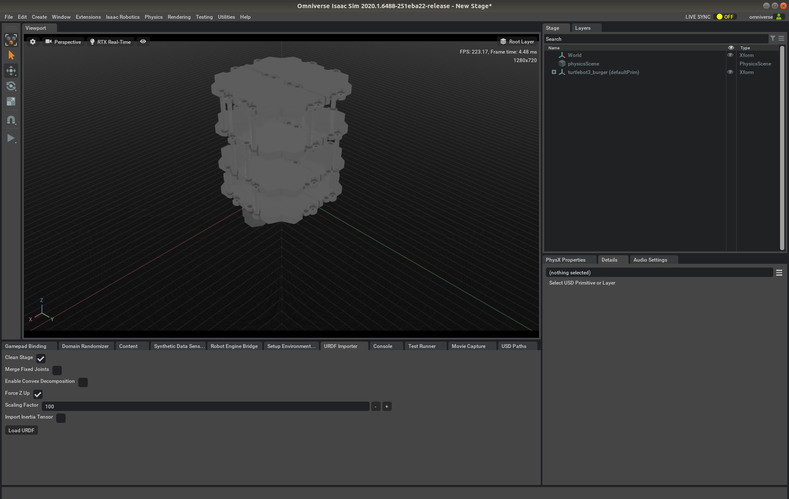
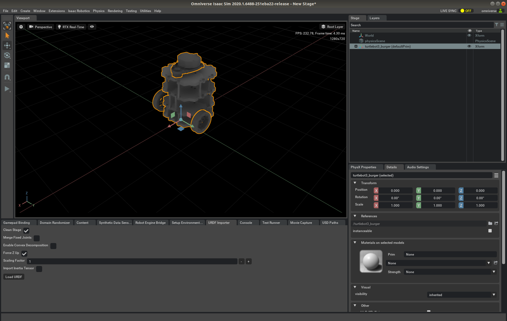
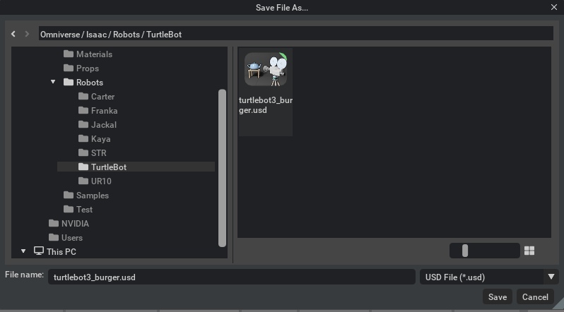
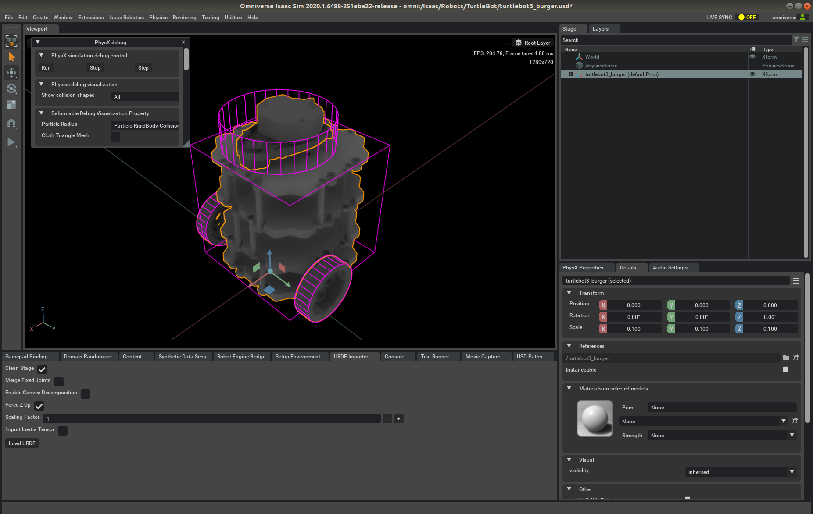
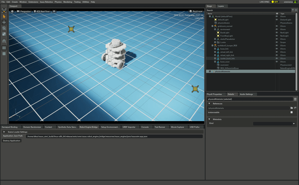

# TurtleBot from ROS to Isaac with Omniverse

## Import URDF
Omniverse uses [Universal Scene Description (USD)](https://developer.nvidia.com/usd) system to represent all objects, including machines and environments. To use URDF model from ROS, the model have to be imported first. Follow [URDF Importer](https://docs.omniverse.nvidia.com/robotics/text/Robotics_URDF.html) tutorial from Omniverse for more information.

### Get TurtleBot URDF
* Download TurtleBot description from official [repository](https://github.com/ROBOTIS-GIT/turtlebot3/tree/master/turtlebot3_description).

* Convert the Xacro file pure URDF file.
```bash
cd urdf
rosrun xacro xacro -o turtlebot3_burger_original.urdf turtlebot3_burger.urdf.xacro
```

### Import into Omniverse
In Omniverse, go to URDF Importer tab and click <em>Load URDF</em> and select the `turtlebot3_burger_original.urdf` file generated from last step. The model is loaded, but seems a little bit wired as below.


Because in TurtleBot repostory, the mesh is in millimeter, and the unit of length in ROS is meter, we can find lines like `<mesh filename="package://turtlebot3_description/meshes/bases/burger_base.stl" scale="0.001 0.001 0.001"/>` in the URDF file to resize the mesh file. However, currently URDF Importer couldn't regonize the `scale` command. As the unit in Omniverse is, the model mesh is 100 times larger. To solve the issue, the URDF file have to be modified as the mesh file is not easy to edit.

* Make a copy of `turtlebot3_burger_original.urdf` and manually adjust every value in meter to millimeter. At this point, the URDF file is compeletly in millimeter.
* Open URDF Importer, set <em>Scaling Factor</em> to `1` (currently 0.1 is not supported) and import the modified URDF file. Now the model looks correct and is 10 times the actual size.
<!-- * Select the model in <em>Stage</em> and set </em>Scale</em> under <em>Details</em> tab to 0.1 in all axis. -->


Save the stage as USD to Nucleus for later use.


## Modify USD file and add Robot Engine Bridge
To use Isaac SDK to control robot in Omniverse, [Robot Engine Bridge](https://docs.omniverse.nvidia.com/robotics/text/Robotics_Robot_Engine_Bridge.html#) is needed. Before adding REB, first inspect the model and make some modification.

### Check collision
In <em>Physics->PhysX Debug Window</em>, set <em>Show collision shapes</em> to `All` to visual the collision of the robot.



If the collision seems incorrect, check URDF file and if necessary, manually add collison from the mesh under <em>PhysX Properties->Add Prim Component->CollisionAPI</em>.

### Set joint properties
In <em>Stage</em> tab, select <em>turtlebot3_burger->base_link->wheel_left_joint</em>, under <em>PhysX Properties</em> tab, set some reasonable values in <em>Joint Drive</em>.
* targetType = velocity
* damping = 1000
* stiffness = 0

Do the same to <em>wheel_right_joint</em>.

### Add DifferenceBase REB
To control the robot from Isaac, a REB component is needed. DifferentialBase is ideal for a differential driving robot like TurtleBot.

* <em>Create->Isaac->Robot Engine->Differential Base</em>
* Select <em>REB_DifferentialBase</em> from <em>Stage</em> tab.
* In <em>Details</em>, set <em>leftWheelJointName</em> to `wheel_left_joint`, <em>rightWheelJointName</em> to `wheel_right_joint`.
* In <em>Relationship Editor</em>, set <em>chassisPrime</em> to `/turtlebot3_burger` and click <em>Add</em>.
* Save the stage as `turtlebot3_burger_REB.usd`.

## Create test world
* Create a new stage
* Add a Physics Scene by <em>Physics->Add->Physics Scene</em>
* Add a grid room by draging <em>omni:/Isaac/Environments/Grid/gridroom_curved.usd</em> into <em>World</em>
* Add TurtleBot by draging <em>omni:/Isaac/Robots/TurtleBot/turtlebot3_burger_REB.usd</em> into the stage.
* Under <em>Stage</em> tab, select <em>turtlebot3_burger_REB</em>. Under <em>Details</em>, set <em>Positon</em> to `0 0 5`. Under <em>PhysX Properties</em>, untick <em>fixBase</em>.
* Start Robot Engine Bridge <em>Robot Engine Bridge->Create Application</em>.
* Click <em>Play</em>.
* Start a terminal under `~/isaac` and start the control app `bazel run apps/isaac_omniverse_example/turtlebot_control/joystick_sim`.
* Control the TurtleBot with a joystick or go to `localhost:3000` to use a virtual gamepad (If using joystick, L1 has to be hold while controlling).



## Code explain
The application file [joystick_sim.app.json](joystick_sim.app.json) contains two part:
* `differential_base_commander` from Isaac GEMs navigation stack. It contains everything from joystick, virtual gamepad and calcuation for joystick status to control command. The source code can be found at `~/isaac/packages/navigation`.
* An interface node to communicate with Isaac Sim at default port 55000 and 55001.

## Other files
Under [URDF](urdf) folder, the original converted URDF file and the modified URDF file for TurtleBot can be found.

Under [USD](usd) folder, the USD file for turtlebot and the running stage can be found.